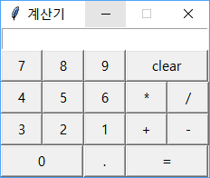

# 과제 4번
1. 제출 기한은 `12일 04일 00시 00분`부터 `12월 14일 23시 59분`까지이며, 추가 제출은 없습니다.
2. 과제에서 부정 행위(과제 공유, 인터넷을 통한 다운로드)가 발견될 시 *0점 처리* 될 수 있습니다.

## 문제 ( 5점 )
다음 기능을 수행하는 계산기 프로그램을 작성하세요.
1. `clear` 버튼을 누르면 디스플레이 모든 결과를 삭제 하게 하세요. ( 1점 )
2. `=` 버튼을 누르면 디스플레이에 있는 수식의 계산식이 계산 되게 하세요 ( 1점 )
3. `0` 부터 `9`까지의 숫자와 `.`을 입력할 수 있게 버튼을 만드세요 ( 1점 )
4. 사칙연산(`+`, `-`, `*`, `/`)를 지원하도록 버튼을 만드세요 ( 1점 )

## 점수
* 각 부분 문제별로 1점
* 모든 부분 문제를 맞춘 경우 1점

#### 기반 코드
```python
from tkinter import *
window = Tk()
window.title("계산기")

window.resizable(width=False, height=False)
window.mainloop()
```

#### 최종 결과
