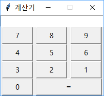

# 14주차 실습 문제
다음과 같은 `tkinter`의 함수를 사용하여 아래와 같은 프로그램을 작성 하세요.
1. 배치는 `grid`함수를 사용 하세요.
2. 계산기의 디스플레이는 `Entry`라는 객체를 사용하여 생성 하세요.
3. `=` 버튼을 누르면 디스플레이에 있는 수식이 계산되게 하세요.
4. 0 ~ 9 까지의 숫자는 아래의 화면과 같이 배치 하세요.

#### 기반 코드
```python
from tkinter import *
window = Tk()
window.title("계산기")

window.resizable(width=False, height=False)
window.mainloop()
```

#### 최종 결과

